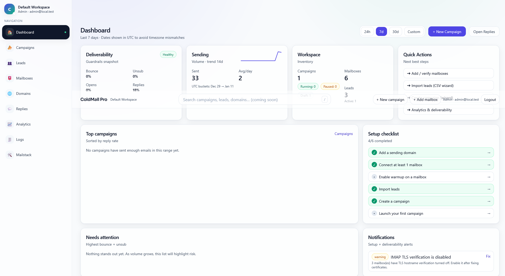
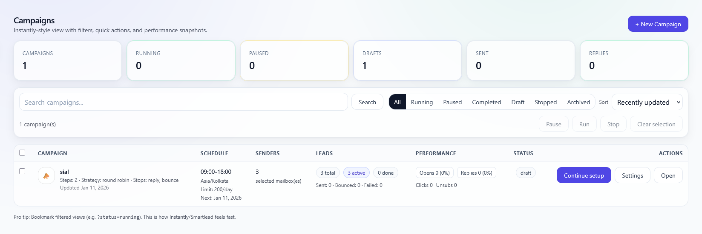
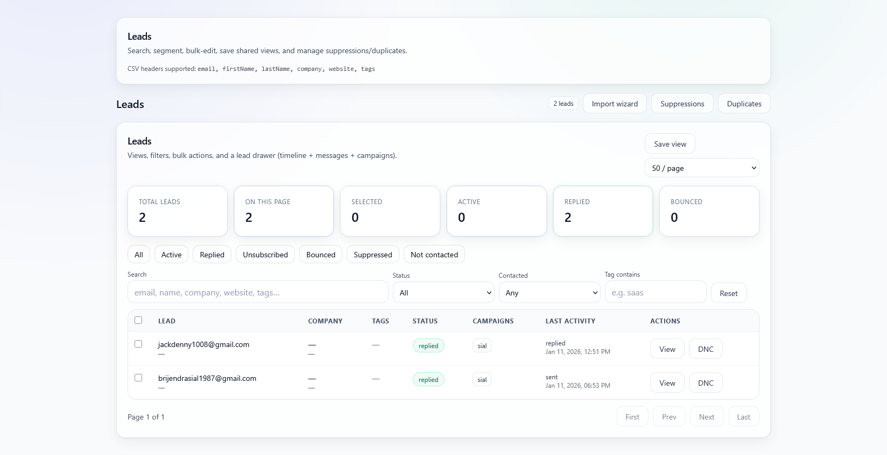
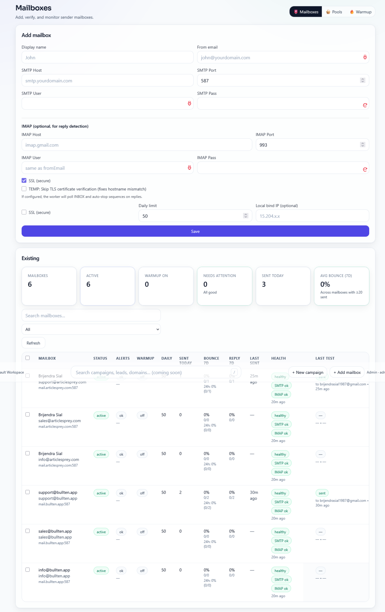

# ColdMail Pro

**Version:** v1.75

## What's new in v1.75
- **AIOps-managed services**: system-level health checks + safe auto-remediation for Exim, Dovecot, MariaDB, ColdMail app, and worker via `coldmail-aiops.timer`.
- **AutoFix**: safe fixes auto-applied; risky fixes are AI suggestions only (never executed automatically).
- **Incidents UI**: Settings → System shows open incidents + Apply Safe Fixes action.
- **AlmaLinux 9 SELinux hardening**: `/var/vmail` relabel + Exim DB boolean + Exim maps restorecon.
- **Tenant delete DNS cleanup**: optional Cloudflare DNS purge on tenant reset/delete.


## Patch fixed76 - Replies command center redesign
- Redesigned the Replies page into a polished shared inbox command center with a premium hero, inbox stats, global search, mailbox/campaign filters, and refresh/AI controls.
- Rebuilt the thread list with stronger conversation cards, avatars, unread badges, status chips, assignment chips, pinned/starred/snoozed indicators, and better empty states.
- Redesigned the conversation workspace with lead summary cards, triage controls, AI draft panel, suggested actions, labels, timeline messages, and a cleaner reply composer.
- Preserved existing reply APIs and behavior: thread loading, state updates, bulk read/unread, assignment, snooze, AI drafts, Google scheduling, and send reply.
- Kept the corrected `coldmail-pro/` project folder structure for direct deployment.

## Patch fixed73 - Domains DNS command center redesign
- Rebuilt the Domains page into a cleaner DNS command center with a premium hero, workflow cards, domain launchpad, SPF preview panel, and card-based domain fleet.
- Redesigned the Add domain flow into focused sections for tenant/domain batch, outbound IP pool, SPF preview, and advanced Cloudflare/server defaults.
- Replaced the cramped domain table with responsive domain health cards showing score, SPF/DKIM/DMARC/MX status, issues, Mailstack linkage, and actions.
- Redesigned the domain detail workspace with a dark hero, DNS health radar, record status panels, Cloudflare/manual DNS cockpit, provisioning area, DKIM rotation studio, tracking CNAME, and danger zone.
- Preserved existing APIs and behavior for DKIM generation, DNS checks, Cloudflare sync, Mailstack provisioning, DKIM rotation, IP rotation, and deletion.


## Patch fixed70 - Campaigns command center + campaign workspace redesign
- Rebuilt the Campaigns list screen into a full command center with a dark gradient hero, deliverability score ring, quick actions, fleet metrics, ops radar, and a card-style campaign fleet.
- Replaced the cramped table-first layout with searchable/filterable campaign cards that show schedule, sender load, lead progress, engagement, status, health, and actions in a cleaner responsive flow.
- Preserved existing campaign actions: run/pause, duplicate, settings, analytics, bulk actions, DNS checks, and pre-send QA validation modal.
- Added a shared premium campaign inner-page hero and tab bar across overview, mailboxes, settings, analytics, deliverability, funnel, edit sequence, and enroll leads pages.
- Kept backend/API logic intact; this patch is focused on UX, layout, and visual clarity.

## Patch fixed65 - Leads command center redesign
- Rebuilt the Leads page into a wide CRM-style command center with a premium gradient hero, cleaner action buttons, and stronger stats.
- Removed the duplicate cramped page header so the Leads screen opens directly into the new workspace.
- Added a sticky left workspace rail for quick tools, presets, saved views, lists, suppressions, and duplicates.
- Reorganized filters into a calm two-row “Find and focus” panel with better spacing and larger controls.
- Redesigned the bulk-action area into a highlighted command bar with grouped actions and aligned stage/owner/list controls.
- Restyled the lead table with better spacing, avatars, status pills, clearer company/activity columns, and a polished pagination footer.
- Kept the fixed64 enrichment modal and valid-only import behavior intact.

Self-hosted **cold email + warmup** app built with **Next.js 14**, **Prisma**, and **MariaDB**.

> Not affiliated with Instantly.ai or Mailgun. “Instantly-style” is used as a product description only.

## Demo
You can access the live demo here:
- https://demo.coldmailpro.io

> Note: The demo environment may be reset periodically.

## Screenshots

<p align="center">
  
</p>

<table>
  <tr>
    <td width="50%"></td>
    <td width="50%"></td>
  </tr>
</table>

<p align="center">
  
</p>

> Want to add more? Drop PNGs into `docs/screenshots/` and link them here.

## Features
- Campaigns + multi-step sequences (Instantly-style list: search/sort/status/health filters, bulk run/pause/stop/archive/duplicate, health pill, ops alerts for spikes/DNS/capacity with inline drill-down)
- Campaign analytics: step summary + per-variant breakdown, **variant winners** (reply-rate winner + uplift)
- Deliverability drill-down: template QA, sender throttles, and **guardrails (auto-pause thresholds)**
- Campaign mailbox dashboard: visual sender **health + load per campaign** (sent/queue/bounces/replies), with 1-click **cooldown clear**
- Lead import + dedupe
- Manual lead add (single lead) + optional email verification (ping-email)
- Import wizard: optional email verification (MX/SMTP) with invalid-row handling
- Leads (workflow): bulk actions (tag/verify/enrich/delete/assign owner/move list/**create tasks**/**snooze**), stages + optional Kanban view (**drag → stage update**)
- Leads (productivity): per-lead drawer with notes/call logs/meetings, tasks/reminders, and an activity timeline
- Leads (quality & safety): email risk badges (catch-all/free/role/disposable/no-MX/suppressed), email fallback generator (pattern suggestions) + verify-before-import
- Mailboxes: health checks + test sends, advanced SMTP/IMAP editing (no password reveal), IMAP cursor reset, CSV export, safe delete (keeps historical message rows), **bulk warmup toggles**, and **per-campaign cooldown management** (view, clear, and add manual cooldowns)
- Warmup suite: profiles + ramp plan + seed + internal mailbox placement tracking (inbox/spam) + auto-open/star engagement simulation + template library + AI template generator + **timezone-aware daily targets/counts** + **pacing (min gap)** + **thread reuse + multi-turn follow-ups** + **Activity analytics & recent message log (14d)** + **manual “Re-check placement” button** + **Ramp calendar** + **Thread viewer** + **Seed health dashboard (bulk test)** + **auto-disable warmup on spam spike** + **Warmup Control Center (worker heartbeat, mailbox health, actions, logs)**
- SMTP mailbox pools + rotation (weighted) + score-based routing (healthiest, score+idle)
- Worker-based sending + scheduling + daily limits + pacing
- Open/click tracking (pixel + redirect)
- Unsubscribe + suppression lists
- Basic bounce handling (SMTP errors + optional IMAP DSN parsing)
- Dashboard command center: **today send capacity/pacing**, replies triage snapshot, queue health, DNS/warmup signals, plus **top broken domains**, bounce reason breakdown, and recipient-domain hotspots (with 1-click drill-down to Analytics/Leads)
- Multi-tenant workspaces + users
- Message logs + analytics
- Rich Settings: account/workspace, password change, **2FA (TOTP)**, sessions/devices
- Team/Security: invites, roles, audit log (who changed what)

## Warmup Control Center

A dedicated operations view for warmup health and debugging:

- Worker heartbeat (detects if the warmup worker is running)
- Mailbox health table (warmup on/off, IMAP configured, last activity, placement counts)
- One-click actions: pause/resume warmup, force warmup tick, force placement/seed checks, and **Test IMAP** (lists folders + probes Gmail All Mail/Spam even if hidden)
- Log viewer (recent warmup job logs and errors)

### Gmail/Google Workspace notes
Warmup placement and starring depend on IMAP visibility. If placement stays **unknown**, ensure:

- IMAP is enabled in Gmail
- The **All Mail** and **Spam** labels are set to **Show in IMAP** (Gmail Settings → Labels)
- You are using a Gmail **App Password** for IMAP (recommended for accounts with 2FA)

The warmup worker scans INBOX and also attempts All Mail/Archive + Spam/Junk folders (with probing) to avoid “unknown” placement due to auto-archiving.

## Tech stack
- Web: Next.js 14 (App Router), React, Tailwind
- DB: MariaDB/MySQL via Prisma
- Worker: Node background process (`worker/worker.ts`) for sending and scheduled jobs

## Requirements
### Production server
- **AlmaLinux 9** (required)

### Local development
- Node.js 20+
- MariaDB 10.6+ (or 10.11 LTS)

## Quick start (local)
1) Copy env
```bash
cp .env.example .env
```

2) Start MariaDB (Docker) (optional)
```bash
docker compose up -d db adminer
```

3) Install dependencies
```bash
npm install
```

4) Prisma + seed
```bash
# IMPORTANT: Fresh installs must use migrations (do NOT run `prisma db push`)
# Verify prisma/migrations contains ONLY the init migration
bash scripts/verify-migrations.sh

# Apply migrations (fresh install)
npx prisma migrate deploy
npx prisma generate
npm run seed
```

Optional helper (same steps):
```bash
bash scripts/db-fresh-install.sh
```

5) Run web + worker
```bash
npm run dev
*(in another terminal)*
npm run worker:dev
```

App: `http://localhost:3000`

Default seed user:
- email: `admin@local.test`
- password: `Admin@12345`

## Production deployment
### Upgrading from older installs (baseline)
If you’re upgrading a server that already has an existing database created by older “ALTER-only” migrations, **baseline** the new init migration once:

```bash
# Mark the init migration as already applied (no schema changes)
npx prisma migrate resolve --applied 20260112000000_init
```

If Prisma complains about missing migrations that no longer exist locally, remove their rows from `_prisma_migrations` (the old folder names), then re-run:

```bash
npx prisma migrate status
npx prisma migrate deploy
```
0) Install mail server (Mailstack) on the server **first**

```bash
/root/coldmail-pro/scripts/mailstack.sh install \
  --hostname <YOUR_HOSTNAME> \
  --email <YOUR_EMAIL> \
  --mailbox <MAILBOX_EMAIL> \
  --mailpass '<MAILBOX_PASSWORD>'
```

- `<YOUR_HOSTNAME>` is your server hostname (example: `srv1.us1.mainip.vh.hadimba.com`) — replace it with yours.
- Replace `<YOUR_EMAIL>`, `<MAILBOX_EMAIL>`, `<MAILBOX_PASSWORD>` with your own values.

1) Build
```bash
npm install
npm run prisma:generate
npm run build
```

2) Database + migrations (production)
```bash
# Create the database if it doesn't exist
mysql -u root -p -e "CREATE DATABASE IF NOT EXISTS coldmail CHARACTER SET utf8mb4 COLLATE utf8mb4_unicode_ci;"

# Apply migrations
npx prisma migrate deploy
```

> Fresh re-install? Drop + recreate the DB first:
```bash
mysql -u root -p -e "DROP DATABASE IF EXISTS coldmail; CREATE DATABASE coldmail CHARACTER SET utf8mb4 COLLATE utf8mb4_unicode_ci;"
npx prisma migrate deploy
```

3) Start web + worker (separate processes)
```bash
npm run start
npm run worker:prod
```

Use a process manager (systemd/pm2/Docker) for both processes.

## Mailstack integration (optional)
This repo includes an integrated UI under **App → Mailstack** that can run:
- `mailstack.sh` (installer)
- `mailstack-addon.sh` (tenant provisioning, Cloudflare DNS, DKIM/SPF/DMARC, mailbox creation, IP rotation)

Env defaults:
- `MAILSTACK_SCRIPT=./scripts/mailstack.sh`
- `MAILSTACK_ADDON_SCRIPT=./scripts/mailstack-addon.sh`

Note: `scripts/*.sh` are shipped with executable permissions.

Recommended: run the worker as a non-root user and allow only these scripts via sudo.


### Installing Mailstack (server prerequisite)
Run this on the server before using the Mailstack UI:

```bash
/root/coldmail-pro/scripts/mailstack.sh install \
  --hostname <YOUR_HOSTNAME> \
  --email <YOUR_EMAIL> \
  --mailbox <MAILBOX_EMAIL> \
  --mailpass '<MAILBOX_PASSWORD>'
```


## Email verification (optional: ping-email)

ColdMail Pro can verify lead emails **before saving** using `ping-email` (syntax/domain/MX and optional SMTP mailbox verification).

Where it's available:
- **Leads → Add lead** (manual add): verify before saving, choose verification mode.
- **Leads → Import CSV wizard**: optionally verify each row during import, and either *skip invalid rows* or *stop on first error*.
- **Leads → ✨ Enrich by website → Discover emails**: shows **all emails found**, then you can **Select → Verify (ping-email) → Import**. Includes:
  - **Risk score + flags** per email (catch-all, free provider, role-based, disposable, no-MX, suppressed)
  - **Manual check before adding** (verify first, then add)
  - **Email fallback generator**: generate common patterns (first.last, f.last, etc.) and verify before importing
  - **Auto-suppress safety**: suppressed (DNC) emails are blocked during create + CSV import + AI import

Verification modes:
- **Full (MX + SMTP mailbox check)**: attempts SMTP verification to confirm mailbox (best-effort).
- **Safe (syntax + domain + MX only)**: does **not** confirm mailbox existence (useful when outbound SMTP is blocked).

### Environment variables

Add these to your `.env` (see `.env.example`):

```env
# Enable/disable ping-email verification
PING_EMAIL_ENABLED=1

# Required for SMTP HELO/EHLO identity (use your server hostname)
PING_EMAIL_FQDN=your.server.hostname

# Sender used during verification (must be a real address on your domain)
PING_EMAIL_SENDER=verify@yourdomain.com

# SMTP port (25 is typical for MX). If your VPS blocks outbound 25, use Safe mode.
PING_EMAIL_PORT=25

# Optional tuning
PING_EMAIL_TIMEOUT_MS=8000
PING_EMAIL_ATTEMPTS=1
```

### Notes
- Many providers (including Gmail) may **not reliably disclose mailbox existence** via SMTP (anti-enumeration), so Full mode is still best-effort.
- If your VPS blocks outbound port 25, Full mode will fail—use Safe mode or unblock/relay SMTP.

## Leads AI (optional)

ColdMail Pro can use an **OpenAI-compatible** API to add AI helpers inside the Leads screen.

Where it's available:
- **Leads → select leads** → bulk bar → **✨ AI tags** (suggests a shared tag set and lets you apply it).
- **Leads → select leads** → bulk bar → **✨ AI enrich** (suggests missing fields like name/company/website; applies in safe mode by default: *fill missing only*).
- **Leads → select leads** → bulk bar → **+ Task** (creates the same follow-up/reminder task for all selected leads).
- **Leads → select leads** → bulk bar → **Snooze / Unsnooze** (hide leads until a chosen date so you can work a clean queue).
- **Leads** (top right) → **✨ AI segments** (suggests useful saved views/segments; you can apply or save them).
- **Leads** (top right) → **✨ Enrich by website** (paste a company site like `https://acme.com`).
  - If you already have leads with matching email domains (e.g. `@acme.com`), it enriches missing fields in bulk.
  - It can optionally discover **published emails via AI web search** (similar to ChatGPT browsing), create leads for them (skip duplicates), then enrich.
  - The modal shows AI-labeled context for each found email (purpose, recommendation, confidence) and links to evidence URLs when available.

### Environment variables

Add these to your `.env` (see `.env.example`):

```env
LEADS_AI_ENABLED=1

# Shared AI settings (OpenAI / OpenRouter / local gateway)
AI_BASE_URL=https://api.openai.com/v1
AI_API_KEY=...
AI_MODEL=gpt-4o-mini
AI_TIMEOUT_MS=60000

# AI web search (recommended for email discovery without crawling)
AI_WEBSEARCH_ENABLED=1
AI_WEBSEARCH_MODEL=gpt-5
AI_WEBSEARCH_MAX_TOOL_CALLS=3
AI_WEBSEARCH_TIMEOUT_MS=120000


## Replies AI (optional)

ColdMail Pro can auto-triage inbound replies and (optionally) auto-send replies for **positive** responses.

In the **Replies** tab you get:
- 🏷️ Sentiment + intent + confidence label for the latest inbound reply
- ✨ One-click "AI draft" to generate a reply
- "Insert to reply" to drop the draft into the composer
- Optional **Autopilot**: worker can auto-send the AI draft for positive replies above a confidence threshold (unless the model explicitly says to ignore/close/unsubscribe)
- 📅 Optional **Google Calendar** integration: create a Google Meet invite when a reply contains an exact time (and optionally auto-send a confirmation reply)
- Negative/OOO/unsubscribe replies are ignored (and can be auto-closed)

Enable via env:

```bash
REPLIES_AI_ENABLED=1

# --- Google Calendar (optional, for meeting scheduling) ---
GOOGLE_OAUTH_CLIENT_ID=...
GOOGLE_OAUTH_CLIENT_SECRET=...
# Optional; defaults to ${PUBLIC_APP_URL}/api/integrations/google/callback
GOOGLE_OAUTH_REDIRECT_URL=
# Optional scopes override (space-separated)
GOOGLE_OAUTH_SCOPES=

# Uses the same OpenAI-compatible settings as Leads AI:
AI_BASE_URL=https://api.openai.com/v1
AI_API_KEY=...
AI_MODEL=gpt-4o-mini
AI_TIMEOUT_MS=60000
```

> **Autopilot runs in the worker.** Make sure the worker process receives these env vars.
> - `npm run worker:prod` now loads `.env` automatically.
> - If you run the worker via systemd/pm2/Docker, you still need to pass the env vars to that process.

In **Replies** → click **AI** (top-right of the Conversation panel — visible even before selecting a thread) to configure: Enabled, Mode (suggest/autopilot), Min confidence, an optional booking link, and (if you connected Google) meeting scheduling options.

## Security notes
- Never commit `.env` or any private keys/certs.
- Keep `.env.example` safe (placeholders only).

## License

**Proprietary (MTA). Not for redistribution or sale.**

This project is governed by the **ColdMailPro Proprietary License (MTA)** (see `LICENSE`). You may not redistribute, publish, or sell this software, except as explicitly permitted under an executed Master Terms Agreement (“MTA”).
## Security hardening (applied in this release)

## Mailboxes UX upgrades (v1.7.8)
- Campaign \u2192 Mailboxes dashboard now supports **selection + bulk actions** (warmup on/off, cooldown set/clear).
- Added **Routing preview** modal: shows which mailbox would be picked next for the campaign strategy, with explainable reasons.
- Added **Export CSV** for the current filtered/sorted view.
- Added **quick actions** per mailbox row (cooldown presets + warmup toggle).
## Campaign Mailboxes analytics (v1.7.9)
- Added **Exclude from campaign** toggle per mailbox (without disabling the mailbox globally). Works for pool/all sender modes via `CampaignMailbox.isActive=false` overrides.
- Added **Domains breakdown (7d)** per mailbox: Gmail / Outlook / Yahoo / Other with `sent/bounced` counts.
- Added **Sent trend sparkline (7d)** per mailbox for quick scanning.

### 1) Signed click-tracking links (fixes open redirect)
`/t/click` now requires a valid `sig` query param (HMAC) and only allows `http(s)` destinations.  
New outbound emails automatically generate signed click links.

**New env (recommended):**
- `TRACKING_LINK_SECRET` — secret used to sign/verify tracking links (falls back to `JWT_SECRET` if unset).

### 2) Avoid logging query-string PII from tracking endpoints
The Next.js `middleware.ts` no longer runs on `/t/*`, and request logging no longer stores raw query-string values.
(It records only param names.)

### 3) Separate encryption key from JWT secret (key rotation-friendly)
Mailbox credentials (and other encrypted fields) now prefer `ENCRYPTION_KEY` instead of `JWT_SECRET`.
For backward compatibility, decrypt will also try the legacy JWT-derived key.

**New env (recommended):**
- `ENCRYPTION_KEY` — independent 32-byte key (base64/base64url). If unset, `JWT_SECRET` is used.

### 4) AppLog retention sweep (automatic cleanup)
The worker performs a daily retention sweep using `LOG_RETENTION_DAYS` (default: 30) and deletes older rows from `AppLog`.

### 5) Basic CSRF mitigation for API routes
Middleware blocks cross-origin unsafe requests (POST/PUT/PATCH/DELETE) to `/api/*` when an `Origin` header is present and not allowed.
Use `ALLOWED_ORIGINS` (comma-separated) if you legitimately need cross-origin access.

## Domains DNS Check worker fix (v1.7.9b)
- Fixed a worker crash when running `domain_dns_check` jobs (ReferenceError: `selector is not defined`) which caused the **Domains → Check** button to fail.
- The worker now reports the checked DKIM selector via `records.dkim.selector` (typically `default`).
- Updated the **Domains** table action to render **Open** as a proper button (consistent with other page actions).

### Warmup worker + UI improvements
- Fixed warmup daily targets and "sent today" counts to be **timezone-aware** and to respect **Weekdays only** (aligned with the Ramp calendar).
- Added warmup pacing (prevents bursty warmup) via `WARMUP_MIN_GAP_MINUTES`.
- Added more human-like warmup behavior: "thread reuse" + optional multi-turn follow-ups; threads auto-close at `WARMUP_THREAD_MAX_MESSAGES`.
- Profiles table now shows **daily progress** (sent/target) and the mailbox’s local timezone.


### Bulk warmup profile actions
Warmup → Profiles supports multi-select and one-shot bulk actions:

New: **Warmup Control Center**
- UI: `/app/mailboxes/warmup/control-center`
- APIs: `/api/warmup/control-center/...`
- Shows worker heartbeat, placement summary, warmup job queue stats, mailbox IMAP/warmup health, and a log viewer.
- Includes quick actions: pause/resume mailbox warmup, enqueue warmup tick, run seed check / mailbox placement check, and test IMAP connectivity.
- Enable/disable warmup
- Re-check placement (Inbox vs Spam/Junk) for selected mailboxes
- Check SMTP/IMAP in bulk
- Run warmup now in bulk
- Delete profiles in bulk
- Bulk editor to update ramp + window settings and **copy settings from** a known-good mailbox
- **Inline “Copy profile”** action on a row to set it as the copy source
- **Presets**: apply built-in presets (e.g. “Gmail safe ramp”) or save your own presets locally (per-browser)


## AutoFix (self-healing)

The worker includes an optional **AutoFix** layer that can automatically apply **safe** fixes when common
infrastructure errors are detected (SELinux labels, Exim map permissions, Exim DB lookup SELinux boolean),
and can generate **suggestions** (AI) for risky/unknown failures.

Environment variables:
- `AUTOFIX_ENABLED` (default: `true`)
- `AUTOFIX_AUTO_APPLY_SAFE` (default: `true`)
- `AUTOFIX_AI_SUGGESTIONS` (default: `true`) – requires `AI_API_KEY`
- `AUTOFIX_MAX_SAFE_ATTEMPTS_PER_JOB` (default: `1`)

Safe fixes are applied via a strict allowlist and executed through the existing provisioning runner (sudo-wrapped).
AI suggestions are logged to the JobLog but **never applied automatically**.

## Deploy / Upgrade
### 1) Pull latest code + install deps
```bash
git pull
npm ci
```

### 2) Prisma migrations + regenerate client
```bash
npx prisma migrate deploy
npx prisma generate
```

### 3) Restart app + worker
Use whatever you run in production (systemd / pm2 / docker). Example:
```bash
systemctl restart coldmail-app coldmail-worker
```

## AIOps Agent (systemd)
ColdMail includes a **system-level AIOps agent** that monitors core services installed/managed by the stack and performs **safe auto-recovery**.

**Monitored services (default):**
- `exim`
- `dovecot`
- `mariadb`
- `coldmail-app`
- `coldmail-worker`

**Installed units:**
- `/etc/systemd/system/coldmail-aiops.service`
- `/etc/systemd/system/coldmail-aiops.timer`

The timer runs every minute.

### Install / enable the AIOps agent
If you run the installer (`scripts/mailstack.sh`) it enables the timer automatically.
For existing servers:

```bash
cp -f scripts/systemd/coldmail-aiops.service /etc/systemd/system/coldmail-aiops.service
cp -f scripts/systemd/coldmail-aiops.timer /etc/systemd/system/coldmail-aiops.timer
systemctl daemon-reload
systemctl enable --now coldmail-aiops.timer
```

### SELinux note (AlmaLinux 9)
systemd may refuse to execute scripts from `/root` (`admin_home_t`). The installer copies the agent to:
- `/usr/local/bin/coldmail-aiops-agent`

You can verify:
```bash
ls -lZ /usr/local/bin/coldmail-aiops-agent
systemctl status coldmail-aiops.timer --no-pager -l
```

### Logs
```bash
tail -f /var/log/coldmail-aiops.log
```

## AutoFix + Incidents
- **Safe fixes** are applied automatically by the worker when a job fails (e.g., SELinux contexts, exim maps perms, restart services).
- **Risky fixes** are **AI suggestions only** and are never executed automatically.

UI:
- Go to **Settings → System** to see:
  - **Incidents** (open issues detected) + “Apply safe fixes”
  - **AutoFix activity** (safe applied + AI suggested)

Environment flags:
```env
AUTOFIX_ENABLED=true
AUTOFIX_AUTO_APPLY_SAFE=true
AUTOFIX_AI_SUGGESTIONS=true
AUTOFIX_MAX_SAFE_ATTEMPTS_PER_JOB=1
AIOPS_ENABLED=true
AIOPS_AI_ANALYSIS=true
```

---

## Hotfix: AIOps Incident DB logging (v1.75-fixed4)

- AIOps agent now **logs why incident DB writes are skipped or fail** (missing `.env`, missing `DATABASE_URL`, missing mysql client, table not found, mysql errors).
- Incident insert now uses **non-interactive mysql auth** (`MYSQL_PWD`) and is tolerant to table name variants: `Incident` / `incidents` / `incident`.

If the UI still shows no incidents, check `/var/log/coldmail-aiops.log` for `[DB] ...` lines to see the exact reason.

## Fixed56: automatic MailStack TLS issuance and renewal restarts

MailStack TLS automation now installs automatically when Cloudflare is initialized, when tenant setup runs, and when DNS sync runs. It adds:

- A certbot deploy hook at `/etc/letsencrypt/renewal-hooks/deploy/20-mailstack-tenant-sni.sh`
- A retry timer at `mailstack-tls-auto.timer`
- A stable runner at `/usr/local/sbin/mailstack-addon`
- Automatic cert copy from `/etc/letsencrypt/live/mail.<domain>/` into `/etc/mailstack/certs/mail.<domain>/`
- Automatic Dovecot SNI config rebuild at `/etc/dovecot/conf.d/99-mailstack-sni.conf`
- Automatic `systemctl restart dovecot` and `systemctl restart exim` after issue, renewal, or sync

Useful commands:

```bash
sudo scripts/mailstack-addon.sh tls-auto-install
sudo scripts/mailstack-addon.sh tls-auto-run
sudo scripts/mailstack-addon.sh tls-issue --tenant TENANT_NAME
sudo scripts/mailstack-addon.sh tls-sync-renewed
sudo systemctl status mailstack-tls-auto.timer
```
---

## Fixed57: full patch documentation + GitHub update notes

This package documents the full stabilization work done across the fixed15 → fixed57 patch line. The application now builds through the full production command:

```bash
npm run build
```

The build command now performs:

```bash
node scripts/clean-build.mjs && next build && tsc -p tsconfig.worker.json
```

That means the Next.js app, route generation, lint/type validation, and standalone worker TypeScript compile are all covered by the same command.

### Important upgrade command

For clean upgrades from any earlier fixed package, remove the old extracted folder first so stale `.next`, worker artifacts, or old route files cannot remain on disk:

```bash
rm -rf coldmail-pro
unzip coldmail-pro-v1.75-fixed57-readme-full-changelog.zip
cd coldmail-pro
npm install
npm run build
```

### GitHub update command summary

To update the GitHub repository at `https://github.com/Brijendrasial/ColdMailPro`, copy the contents of this package into your local clone, commit, and push:

```bash
git clone https://github.com/Brijendrasial/ColdMailPro.git
cd ColdMailPro
rsync -a --delete --exclude='.git' /path/to/extracted/coldmail-pro/ ./
git status
git add .
git commit -m "Stabilize build and automate MailStack SSL renewal"
git push origin main
```

If your default branch is `master`, replace `main` with `master`.

---

## Complete patch changelog: fixed15 → fixed57

The following sections explain the changes added during the stabilization cycle. They are grouped by purpose instead of raw commit order so future maintenance is easier.

### 1. JSX lint and React warning cleanup

Several production builds were blocked by strict Next.js ESLint rules. The JSX text had unescaped apostrophes and quotes in a few components, which triggered `react/no-unescaped-entities`. These were fixed by escaping or rewriting the affected JSX text.

Affected areas included:

- `app/app/mailboxes/warmup/WarmupClient.tsx`
- `components/campaigns/campaign-create-wizard.tsx`
- `components/leads/leads-client.tsx`

React hook warnings were also cleaned up in the main warning hotspots so the build output is much cleaner:

- Warmup client loading effects
- Campaign create wizard memo/effect dependencies
- Leads client toast and memo dependency warnings
- Team replies inbox detail loading

The 2FA QR image was changed from raw `` usage to Next.js image handling where appropriate to avoid the `@next/next/no-img-element` warning.

### 2. Type declarations for untyped packages

The project used packages that either lacked installed TypeScript declarations or had incomplete local declarations. Local shims and dev type dependencies were added so production type-checking can complete without weakening the app globally.

Packages covered include:

- `bcryptjs`
- `nodemailer`
- `mailparser`
- `qrcode`
- `ping-email`

The `nodemailer` type shim now includes a required `verify()` method because the SMTP test route and worker call `transport.verify()` directly.

The `mailparser` shim now includes practical parsed-mail fields such as:

- `from?.text`
- `subject`
- `text`
- `html`
- `headers.get(...)`

This fixed worker IMAP parsing type errors without changing runtime behavior.

### 3. Warmup API request body typing fixes

Several warmup routes parsed JSON bodies where arrays were inferred as `unknown[]`. Prisma requires `string[]` for filters such as:

```ts
where: { id: { in: mailboxIds } }
```

The following routes were fixed by validating and narrowing IDs to `string[]`:

- `app/api/warmup/profiles/bulk-delete/route.ts`
- `app/api/warmup/profiles/bulk-update/route.ts`

This prevents Prisma type errors and also makes the runtime request validation safer.

### 4. Prisma enum and nullable relation fixes

The warmup template seeding route now uses proper Prisma create input typing so template types like `initial` and `reply` are treated as enum-compatible values instead of loose strings.

Updated file:

- `app/api/warmup/templates/seed-defaults/route.ts`

Unsubscribe tracking was also hardened for messages that may not have a `campaignId` or `leadId`. Campaign auto-pause and enrollment-stop logic now only run when those IDs exist.

Updated file:

- `app/t/unsub/route.ts`

This avoids nullable Prisma filter errors and protects tracking routes from crashing on non-campaign messages.

### 5. Campaign analytics and dashboard typing fixes

Campaign analytics previously allowed `stepNumber` to be `null` while the row type required a number. The analytics aggregation now skips rows without a valid step number before inserting them into typed results.

Updated file:

- `app/app/campaigns/[id]/analytics/page.tsx`

The campaign mailbox dashboard had worker compile errors from `new Map(...)` inferring `unknown` values from Prisma aggregate rows. A typed helper now converts grouped Prisma count rows into `Map<string, number>` so all rate calculations work with real numbers.

Updated file:

- `lib/campaign-mailboxes-dashboard.ts`

This fixed calculations for:

- sent in the last 24 hours
- sent in the last 7 days
- queued messages
- failed messages
- bounce rate
- hard bounce rate
- unsubscribe rate
- sender health penalty calculations

### 6. Shared component and UI typing fixes

The shared `Card` component now supports usages where `children` are optional. This fixed self-closing status cards such as campaign “Not found” states.

Affected files included:

- `components/ui.tsx`
- `app/app/campaigns/[id]/deliverability/page.tsx`
- `app/app/campaigns/[id]/funnel/page.tsx`

MailStack and Settings components now have explicit row types instead of relying on implicit `any` from database/API responses.

Affected files included:

- `app/app/mailstack/page.tsx`
- `app/app/settings/IncidentsCard.tsx`

### 7. Leads page fixes

The leads client had several production type issues that were fixed without removing features.

Changes include:

- Added missing `bulkBusy` state for AI bulk enrichment.
- Disabled the bulk enrich button while enrichment is running.
- Added safe company verification risk score rendering.
- Replaced repeated optional-chain comparisons with typed helper renderers.
- Made risk flags rendering safe.

Updated file:

- `components/leads/leads-client.tsx`

### 8. Replies AI and Google Calendar scheduling types

The team replies inbox UI checks whether an AI reply created a scheduled calendar event. The AI action type now includes optional scheduling fields:

- `scheduledEventId?: string | null`
- `scheduledMeetLink?: string | null`

Updated file:

- `components/replies/team-replies-inbox.tsx`

The Google integration callback was also updated to use absolute redirects. Next.js requires absolute URLs in route handlers during build/export, so relative redirects such as `/app/replies?google=error` were replaced with safe absolute redirects using the existing URL helper.

Updated route:

- `app/api/integrations/google/callback/route.ts`

### 9. AI helper and AIOps typing fixes

AI tag parsing now explicitly returns `string[]` instead of letting `Set` inference produce `unknown[]`.

Updated file:

- `lib/ai.ts`

A missing JSON chat helper was added so AI operations can request structured JSON responses through the configured OpenAI-compatible endpoint.

Added helper:

- `aiChatJson<T>()`

AIOps environment flags were added to the typed environment object:

- `AIOPS_ENABLED`
- `AIOPS_AI_ANALYSIS`

Updated file:

- `lib/env.ts`

### 10. Worker logging and mailer contract fixes

`appLogAsync` now uses the newer single-object call style everywhere in the worker. Old positional calls were updated.

Updated file:

- `worker/worker.ts`

The mailer input type now supports an optional `log` callback because the worker passes a warmup log callback into `sendEmail(...)`.

Updated file:

- `lib/mailer.ts`

The mailer now safely reports send lifecycle events through the callback when provided:

- send start
- send success
- send failure

### 11. Worker shell template escaping

A shell script embedded inside `worker/worker.ts` used shell variables such as `${file}`. TypeScript interpreted these as JavaScript template interpolation. Those shell variables are now escaped so the generated script remains correct and TypeScript no longer looks for a JavaScript variable named `file`.

Updated file:

- `worker/worker.ts`

### 12. AIOps incident worker handler

The worker dispatcher referenced `aiops_apply_incident`, but the handler was missing. A safe handler was added.

The handler records safe suggested incident actions and does not execute arbitrary AI-generated shell commands automatically.

Updated file:

- `worker/worker.ts`

### 13. IMAP worker safety and typing fixes

The worker now handles IMAP library return values that may be `false` instead of an object or array.

Fixes include:

- Guarding `client.mailbox` before reading `uidNext`
- Guarding `client.search(...)` before using `.slice()` or `.length`
- Guarding `client.fetchOne(...)` before reading `.source`

Updated file:

- `worker/worker.ts`

This prevents both TypeScript errors and possible runtime crashes during IMAP polling, warmup placement checks, and reply ingestion.

### 14. Next.js route and build stability fixes

The build process now starts by cleaning stale build artifacts. This prevents broken `.next` manifests, stale page traces, or old route outputs from affecting the next build.

Added file:

- `scripts/clean-build.mjs`

Updated `package.json` build script:

```bash
node scripts/clean-build.mjs && next build && tsc -p tsconfig.worker.json
```

The cleaner removes:

- `.next`
- `tsconfig.tsbuildinfo`
- `worker-dist/tsconfig.worker.tsbuildinfo`

A dedicated `app/not-found.tsx` was added so `/_not-found` is always available during App Router builds.

API routes that depend on auth, cookies, DB access, tracking, or runtime request state are now marked as dynamic Node routes:

```ts
export const dynamic = "force-dynamic";
export const runtime = "nodejs";
```

This prevents Next.js from trying to statically prerender API routes that must run at request time.

### 15. Two-factor route compatibility

Physical App Router folders named `2fa` caused module resolution problems during production builds. The real route folders were moved to `twofa`, while legacy `/2fa/...` URLs remain supported.

New internal route structure:

- `/api/auth/twofa/verify`
- `/api/settings/twofa/start`
- `/api/settings/twofa/verify`
- `/api/settings/twofa/disable`
- `/api/settings/twofa/recovery/regenerate`

Legacy compatibility remains available through middleware rewrites:

- `/api/auth/2fa/...` → `/api/auth/twofa/...`
- `/api/settings/2fa/...` → `/api/settings/twofa/...`

Frontend calls were updated to use the new `twofa` paths directly.

### 16. Prerender/export hardening

Some routes and fallback pages triggered chunk-loading errors during static generation. The build was hardened by:

- Avoiding brittle static prerendering of login/not-found behavior
- Adding simple Pages Router fallbacks:
  - `pages/404.tsx`
  - `pages/_error.tsx`
- Removing legacy `2fa` rewrites from `next.config.mjs` and moving compatibility into middleware

This keeps the build stable while preserving runtime behavior.

### 17. Search params and pathname null-safety

With the current Next.js/TypeScript setup, navigation hooks can be nullable in some contexts. Components now safely handle those cases.

Updated files:

- `components/campaigns/campaigns-table.tsx`
- `components/dashboard/date-range-controls.tsx`

Fixes include:

- fallback `URLSearchParams`
- fallback pathname for analytics date controls

### 18. Worker TypeScript configuration

The standalone worker TypeScript compile now uses alias-friendly module resolution compatible with the Next app codebase.

Updated file:

- `tsconfig.worker.json`

Important settings:

```json
{
  "module": "ESNext",
  "moduleResolution": "Bundler"
}
```

The worker config also includes the needed project type files:

- `next-env.d.ts`
- `types-untyped-modules.d.ts`

This allows imports like `@/lib/prisma` and `@/lib/env` to resolve correctly during `tsc -p tsconfig.worker.json`.

### 19. MailStack certificate renewal sync

The MailStack SSL issue was caused by a common certbot/SNI mismatch:

- Certbot renews certificates under `/etc/letsencrypt/live/mail.<domain>/`
- Dovecot/Exim may serve copied tenant certificates under `/etc/mailstack/certs/mail.<domain>/`
- Without a deploy hook, renewed certificates may not be copied into the active MailStack SNI folder
- Services may keep serving the old certificate until reloaded or restarted

A certbot deploy hook was added:

```bash
/etc/letsencrypt/renewal-hooks/deploy/20-mailstack-tenant-sni.sh
```

On renewal, it now:

1. Finds renewed `mail.<domain>` certificates.
2. Copies `fullchain.pem` and `privkey.pem` into `/etc/mailstack/certs/mail.<domain>/`.
3. Rebuilds Dovecot SNI config at `/etc/dovecot/conf.d/99-mailstack-sni.conf`.
4. Restarts Dovecot.
5. Restarts Exim.

The important service restart commands are automatic now:

```bash
systemctl restart dovecot
systemctl restart exim
```

Manual repair command:

```bash
sudo scripts/mailstack-addon.sh tls-sync-renewed
```

### 20. Fully automatic MailStack SSL issuance and retry timer

The SSL process is now automated beyond certbot renewal. The addon installs a stable system runner and retry timer so issuance can succeed after DNS propagation completes.

Installed runner:

```bash
/usr/local/sbin/mailstack-addon
```

Installed timer:

```bash
mailstack-tls-auto.timer
```

The timer retries TLS issuance every 30 minutes. This helps when Cloudflare DNS or nameserver propagation is not ready during the first tenant setup attempt.

Automation is installed or refreshed when:

- Cloudflare is initialized
- tenant setup runs
- DNS sync runs
- manual SSL issue runs

Useful commands:

```bash
sudo scripts/mailstack-addon.sh tls-auto-install
sudo scripts/mailstack-addon.sh tls-auto-run
sudo scripts/mailstack-addon.sh tls-issue --tenant TENANT_NAME
sudo scripts/mailstack-addon.sh tls-sync-renewed
sudo systemctl status mailstack-tls-auto.timer
sudo certbot certificates
```

Immediate expired certificate repair:

```bash
sudo scripts/mailstack-addon.sh tls-issue --tenant YOUR_TENANT_NAME
sudo scripts/mailstack-addon.sh tls-sync-renewed
sudo systemctl restart dovecot
sudo systemctl restart exim
```

### 21. Script executable permissions

All shell scripts under `scripts/` are packaged with executable permissions preserved. This matters for server commands such as:

```bash
sudo scripts/mailstack.sh install ...
sudo scripts/mailstack-addon.sh tls-auto-install
sudo scripts/mailstack-addon.sh tls-auto-run
```


### 22. Mailstack server + Roundcube updater buttons

The Mailstack page now includes a **Server maintenance** card with three queued actions:

- **Update all server software**: runs `mailstack-addon.sh server-update`, updates OS/server packages using the available package manager, reapplies safe MailStack permissions/fixes, then restarts MailStack-related services.
- **Update Roundcube latest**: runs `mailstack-addon.sh roundcube-update`, updates Roundcube to the latest package available from enabled repositories, restores the MailStack Roundcube config layout, runs the Roundcube updater when available, then restarts services.
- **Update server + Roundcube**: runs both actions in order.

The update flow is queued as a worker job (`mailstack:system-update`) so the web request returns quickly while the worker streams progress into job logs.

Services restarted automatically when present include:

```bash
exim dovecot nginx php-fpm mariadb mysql redis postfix
```

Manual server commands are also available:

```bash
sudo scripts/mailstack-addon.sh server-update
sudo scripts/mailstack-addon.sh roundcube-update
```

### 23. Final build status for this patch line

The expected successful build output should include:

```bash
✓ Compiled successfully
✓ Linting and checking validity of types
✓ Collecting page data
✓ Generating static pages
✓ Collecting build traces
✓ Finalizing page optimization
```

Then the worker TypeScript step should run:

```bash
tsc -p tsconfig.worker.json
```

If you see stale route or chunk errors after replacing files, remove the extracted folder and unzip again:

```bash
rm -rf coldmail-pro
unzip coldmail-pro-v1.75-fixed57-readme-full-changelog.zip
cd coldmail-pro
npm install
npm run build
```


### fixed59: Mailstack live update popup

The Mailstack **Server maintenance** card now opens a live popup for all maintenance actions instead of silently posting a form:

- **Update all server software** opens a modal, queues `mailstack:system-update` with `mode=server`, polls job status, and streams job logs.
- **Update Roundcube latest** opens the same modal with Roundcube-specific copy and progress stages using `mode=roundcube`.
- **Update server + Roundcube** opens the modal and runs the combined queued job using `mode=both`.
- Added `GET /api/mailstack/system/update/status?jobId=...` for permission-scoped live job status/log polling.
- The popup includes progress stages, a progress bar, live terminal-style logs, copy-log support, retry on failure, and clear worker-running guidance.

Keep the worker process running (`npm run worker:dev` or the production worker service) so queued update jobs advance from queued to running/done.

## Patch fixed60 - MailStack update modal reliability

- Fixed a false failure in the live MailStack update modal where package updates could restart MySQL/MariaDB and cause Prisma to report `Server has closed the connection` while marking the job complete.
- The worker now reconnects Prisma and retries final job status updates after package/service restarts.
- MailStack service restarts now run mail/web/cache services first and database services last, then wait briefly for the database to accept connections again.
- The live popup remains the same: progress, stages, logs, copy logs, retry, and clear error state.

## Patch fixed61 - Roundcube web route repair after latest update

- Fixed the case where `http://SERVER_IP/roundcube/` could show a plain `ok` response after updating Roundcube instead of the Roundcube login page.
- `mailstack-addon.sh roundcube-update` now also repairs the Nginx/PHP-FPM Roundcube route after package updates.
- Added a manual repair command:

```bash
sudo scripts/mailstack-addon.sh roundcube-webfix
```

This command restores the Roundcube config symlink/permissions, detects the correct Roundcube document root (`/usr/share/roundcubemail`, `public_html`, or `public`), writes `/etc/nginx/conf.d/mailstack-roundcube.conf`, tests Nginx config, then restarts `php-fpm` and `nginx`.

Use it immediately on an already-updated server if `/roundcube/` is not opening the login window.

### fixed62 - Roundcube PHP download repair

If `http://SERVER_IP/roundcube/` downloads `index.php` instead of opening the login page, run:

```bash
sudo scripts/mailstack-addon.sh roundcube-webfix
```

This version fixes the Roundcube Nginx route so PHP requests are passed to PHP-FPM instead of being served as static files. The repair command now detects the active PHP-FPM socket/TCP listener, writes the correct `fastcgi_pass`, avoids the `^~` Nginx prefix that blocks PHP regex handling, runs `nginx -t`, and restarts `php-fpm` plus `nginx`.

### fixed63 - Roundcube build selector and upstream stable installer

MailStack maintenance now lets the user choose which Roundcube build should be installed when running **Update Roundcube** or **Update server + Roundcube**.

Available choices:

- **Stable latest from Roundcube.net**: detects the latest upstream stable Roundcube release from GitHub/Roundcube and installs the complete upstream build, such as `1.6.15` when that is the current stable release.
- **Custom upstream version**: installs a specific upstream Roundcube version, for example `1.6.15`.
- **OS package repository**: keeps the older distro-managed behavior for admins who want the repository-provided package, even if that is behind upstream stable.

The worker passes the selected build choice into `scripts/mailstack-addon.sh roundcube-update` and the live update modal shows the chosen build in the job log/popup. The script now supports:

```bash
sudo scripts/mailstack-addon.sh roundcube-update --channel stable
sudo scripts/mailstack-addon.sh roundcube-update --channel custom --version 1.6.15
sudo scripts/mailstack-addon.sh roundcube-update --channel package
```

For upstream installs, the script downloads the `roundcubemail-<version>-complete.tar.gz` release archive, backs up the existing `/usr/share/roundcubemail` directory, syncs the selected build into place, restores the MailStack `/etc/roundcubemail` config layout, runs Roundcube migrations, repairs the Nginx/PHP-FPM `/roundcube/` route, and restarts MailStack services.

### Patch fixed64 - Lead enrichment modal cleanup

- Rebuilt the "Enrich all leads by company website" modal into a cleaner, wider two-column workflow.
- Added clearer step buttons: discover, verify selected, import valid.
- Added stats cards for found, selected, valid, failed, and pending emails.
- Added selection tools: select all, clear, select valid, and remove failed.
- Changed import behavior so it imports only verified-valid selected emails and automatically skips failed or pending selected emails. Users no longer need to manually deselect failed leads after verification.
- Grouped results into clean cards for website-published emails, AI suggestions, manual emails, and generated patterns.
- Moved manual checking, verification settings, and fallback pattern generation into aligned side panels.

## fixed66 - Full app polish system redesign

This release applies a full-app visual polish pass across ColdMail Pro so every page benefits from the same premium command-center design language.

### UI/UX changes

- Redesigned the authenticated app shell with a floating glass top bar, improved action buttons, and a cleaner workspace header.
- Redesigned the left sidebar with stronger active states, workspace card polish, and a more modern navigation feel.
- Rebuilt the shared UI primitives used across pages:
  - `Container`
  - `PageHeader`
  - `Card`
  - `Button`
  - `Input`
  - `Select`
  - `TextArea`
  - `Kpi`
  - `Pill`
  - `Badge`
  - `Modal`
  - `Segmented` / `SegmentedNav`
  - `EmptyState`
- Upgraded global table, card, scrollbar, background, modal, and form styling.
- Redesigned public landing page, login page, 2FA page, and setup page for a premium SaaS-style first impression.
- Existing fixed65 Leads Command Center and fixed64 enrichment modal remain intact.

### Scope

This is a foundation-level redesign pass, so all existing pages receive the new layout system through shared components and app shell improvements while keeping existing business logic, routes, forms, and APIs unchanged.

## fixed67 - Dashboard command center redesign

This release redesigns the main dashboard page as a real outbound command center instead of a dense grid of plain cards.

### Dashboard UI/UX changes

- Added a premium gradient hero with workspace health, date range controls, and primary actions.
- Added a visible deliverability score and sending pulse summary.
- Rebuilt top KPI cards for sent volume, replies, bounce risk, campaigns, leads, and mailboxes.
- Reorganized operational data into clear sections:
  - Today's sending pace
  - Queue health
  - Deliverability radar
  - DNS + warmup
  - Next best actions
  - Setup progress
  - Alerts
  - Top campaigns
  - Needs attention
  - Recent campaigns
  - Live activity
- Improved spacing, card hierarchy, shadows, responsive behavior, and empty states.
- Kept all existing dashboard queries, metrics, links, filters, and backend logic intact.

## fixed68-dashboard-redesign-correct-project-folder

- Repackaged the fixed67 dashboard command-center redesign so all files live under the `coldmail-pro/` project folder inside the zip.
- This ensures copying/extracting the package over an existing `/root/coldmail-pro` or `coldmail-pro` checkout replaces the real app files instead of placing files at the wrong root level.

## Fixed69 - Tailwind opacity build fix

- Fixed production build failure caused by custom Tailwind opacity utilities such as `bg-white/78`.
- Added the custom opacity tokens used by the redesigned UI to `tailwind.config.ts` so `next build` can compile the dashboard styles correctly.
- Preserved the corrected `coldmail-pro/` project folder structure from fixed68.

## fixed71-campaign-inner-hero-import-build-fix

- Fixed the Campaigns inner pages build error caused by missing `CampaignInnerHero` imports.
- Updated analytics, deliverability, and funnel campaign pages to import the shared campaign inner shell component.
- Preserved the fixed70 Campaign Command Center redesign and the correct `coldmail-pro/` package folder structure.


## fixed72-mailboxes-command-center-redesign

- Redesigned the Mailboxes page into a full Mailbox Command Center.
- Added a premium hero, sender-fleet side panel, and clearer SMTP/IMAP add-mailbox flow.
- Reworked existing mailboxes into action-first sender cards with health, bounce, reply, daily usage, test-send, and edit controls.
- Added improved bulk-action toolbar for selected mailboxes.
- Updated related inner mailbox pages: Pools, Warmup Studio, and Warmup Control Center with the same command-center layout.
- Preserved all existing SMTP/IMAP, health check, test send, cooldown, pool, warmup, and worker logic.

## fixed74 - Domain detail layout and overlap repair

- Redesigned the domain detail DNS workspace to remove cramped/overlapping panels.
- Rebuilt the Cloudflare cockpit with a cleaner two-column layout that only splits on very wide screens.
- Rebuilt manual DNS records into scroll-safe record cards so long SPF/DKIM values do not break alignment.
- Reworked Mailstack provisioning into clear sections for readiness, tenant setup, mailbox defaults, authentication defaults, provisioning, and tenant maintenance actions.
- Added safer scroll boxes for long DNS bundle, SPF, DKIM, and DMARC content.
- Changed the app command bar from sticky to normal relative positioning to prevent it from overlaying dense long pages and full-page screenshots.
- Added Tailwind opacity values used by the updated layout.

### fixed75 - Domain DNS check completion/status fix

- Fixed the domain detail "Run check" button appearing stuck even when the worker completed the DNS check.
- `/api/domains/check` now returns the queued or already-running job id.
- Added `/api/domains/check/status` so the domain detail UI can poll DNS check progress and logs live.
- The worker now preserves structured DNS check results in `Job.lastError` after marking domain DNS jobs as `done`, instead of clearing them during the final success update.
- The domain detail button now shows queued/running/done/failed state, recent logs, and refreshes the page when the check completes.

## fixed77 - Analytics Command Center redesign

- Redesigned the Analytics page into a premium command-center layout.
- Added a dark executive hero and performance score panel.
- Rebuilt analytics filters into a clearer slicer workspace.
- Reworked KPI cards, insight cards, campaign leaderboard, mailbox reputation board, funnel, heatmaps, and event stream.
- Kept all analytics API/backend behavior intact.
- Preserved the correct `coldmail-pro/` project folder structure.

## fixed78 - Logs Observability Command Center redesign

- Redesigned the Logs page into a full observability cockpit with a dark executive hero, live event summary, and clear health counters.
- Rebuilt Unified Logs into a polished event stream with severity counters, cleaner filters, trace cards, selected-event inspector, JSON inspection, and better empty states.
- Redesigned the Messages panel into a message flight recorder with status counters, cleaner message cards, recipient/mailbox/campaign context, and failure details.
- Preserved the existing logs/message APIs and backend behavior.
- Preserved the correct `coldmail-pro/` project folder structure.

## fixed79-mailstack-control-center-redesign

- Redesigned `/app/mailstack` into a premium Mailstack Control Center.
- Added fleet metrics for tenants, domains, mailboxes, outbound IPs, and attention state.
- Reworked integration settings into a clear Integration Vault with Cloudflare bootstrap controls.
- Preserved the live server/Roundcube maintenance modal and update workflow.
- Redesigned tenant fleet cards with DNS sync, IP rotation, suspend/unsuspend, and open cockpit actions.
- Redesigned `/app/mailstack/new` into a guided tenant creation flow.
- Redesigned `/app/mailstack/[id]` into a tenant operations cockpit with clear asset panels and danger zone.
- Kept existing MailStack provisioning, Cloudflare, update, tenant action, and worker logic intact.

## fixed80 - Settings Control Center redesign

- Redesigned `/app/settings` into a premium Settings Control Center.
- Added dark hero, security/developer/workspace summary cards, grouped sidebar navigation, active panel header, cleaner account/workspace forms, improved security layout, and clearer danger-zone panels.
- Preserved existing account, password, 2FA, sessions, notifications, deliverability, workspace, team, audit, system, integrations, developer, and danger-zone API behavior.
- Added Tailwind opacity support required by the redesigned settings layout.
